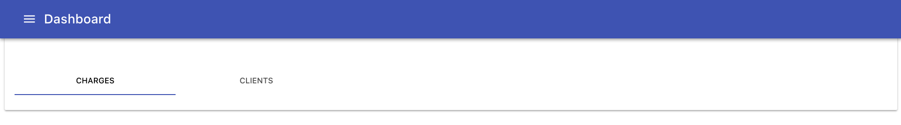
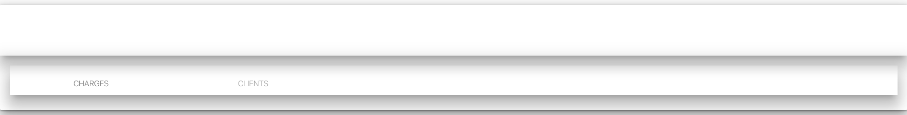

# tlvince-reduced-test-case-material-ui-cra

Reduced test case for https://github.com/facebookincubator/create-react-app/issues/3173

## Expected



## Actual



## How to reproduce

```shell
cd /tmp
git clone https://github.com/tlvince/tlvince-reduced-test-case-material-ui-component.git
cd tlvince-reduced-test-case-material-ui-component
npm link .
cd /tmp
git clone https://github.com/tlvince/tlvince-reduced-test-case-material-ui-cra.git
cd tlvince-reduced-test-case-material-ui-cra
npm link tlvince-reduced-test-case-material-ui-component
npm start
# see app with correct material UI styling, "Dashboard"
# CTRL+C
npm run build
cd build
python2 -m SimpleHTTPServer
# see app with broken material UI styling
```

## Author

© 2017 Tom Vincent <git@tlvince.com> (https://tlvince.com)

## License

Released under the Apache-2.0 license.
